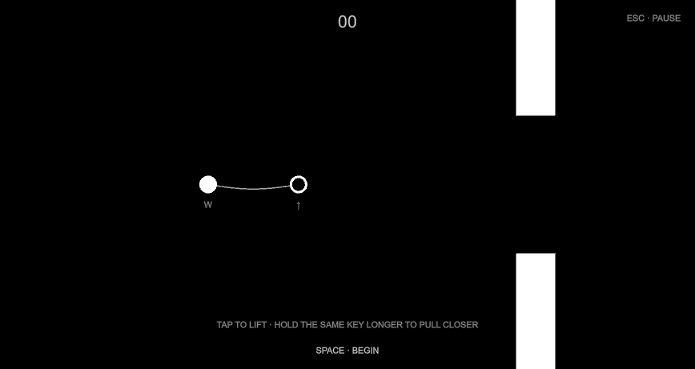

# Twinline

Swing on a rope. Collect gems. Let go at the right moment.

A minimal black-and-white prototype: press **Space** near a node to attach a rope, **Space** again to release and launch into the next arc. The world scrolls; gather gems without hitting the floor or ceiling.

## Play

Download **Twinline-macOS-v0.1.0.zip** from the [Releases page](https://github.com/land-saas/twinline/releases), unzip it, and open **Twinline.app**. Unity is not needed to play.

- **macOS 12 or later**, Intel or Apple silicon.
- This prototype is ad-hoc signed, not Apple-notarized; macOS may ask you to approve opening a downloaded app.

| Key | Action |
| --- | --- |
| **Space** | Begin / retry / resume; in flight: attach or release rope |
| **Tab** | On ready screen: open the legacy two-player co-op flight mode |
| **Esc** | Pause / resume |

**Swing mode (default):** one circle, pendulum physics, gems for score. Nodes glow when you're close enough to attach.

**Co-op flight (Tab on ready):** the earlier two-player tube-flier with rope reeling and gravity flips — kept for comparison and partner playtests.

## Open the Unity project

1. Clone or download the source.
2. In Unity Hub, choose **Add project from disk** and select the folder containing `Assets`, `Packages`, and `ProjectSettings`.
3. Open with **Unity 6000.3.24f1**.
4. Open `Assets/Scenes/Flight.unity` and press **Play**.

The scene builds its player, nodes, gems, and sound at runtime. No external art is required.

## Prototype status

The active prototype is **rope swinging + gem collection**. Co-op flight remains in the codebase (`TwinFlightGame.cs`) and is reachable via **Tab** on the ready screen.

- [Co-op flight mechanics](docs/Mechanics.md)
- [Design research and playtest questions](Design-notes.md)

Run **Twinline → Validate Flight Mechanics** to repeat co-op physics checks (spawns a validation instance if the scene is in swing mode).
